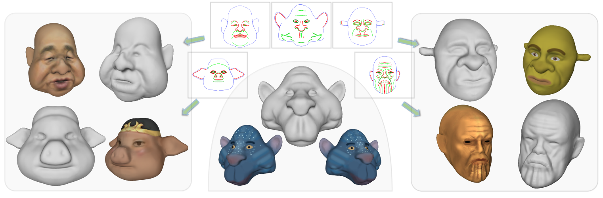

# *SketchMetaFace*

This repository includes the prototype system of *SketchMetaFace*.

> *SketchMetaFace*: A Learning-based Sketching Interface for High-fidelity 3D Character Face Modeling
>
> [Zhongjin Luo](https://zhongjinluo.github.io/), [Dong Du](https://dongdu3.github.io/), [Heming Zhu](https://scholar.google.com/citations?user=u5KCnv0AAAAJ&hl=en), [Yizhou Yu](https://i.cs.hku.hk/~yzyu/), [Xiaoguang Han](https://gaplab.cuhk.edu.cn/), [Hongbo Fu](https://sweb.cityu.edu.hk/hongbofu/)

## Introduction

<center>

</center>

We present *SketchMetaFace*, a novel sketching system designed for amateur users to create high-fidelity 3D character faces. With curvature-aware strokes (valley strokes in green and ridge strokes in red), novice users can smoothly customize detailed 3D heads. Note that our system only outputs geometry without texture and texturing is achieved using commercial modeling tools.

##### | Paper | Project | 

## Demo


## Usage

This system has been tested with Python 3.8, PyTorch 1.7.1, CUDA 10.2 on Ubuntu 18.04. 

- Installation:

  ```
  conda create --name SketchMetaFace -y python=3.8
  conda activate SketchMetaFace
  pip install -r requirements.txt
  ```

- Start by cloning this repo:

  ```
  git clone git@github.com:zhongjinluo/SketchMetaFace.git
  cd SketchMetaFace
  ```

- Download pre-compiled user interface and checkpoints for backend algorithms from [sketchmetaface_files.zip](https://cuhko365-my.sharepoint.com/:u:/g/personal/220019015_link_cuhk_edu_cn/EX_bY3bAhRlBmY2yThCsGGkBA9uYjMS-e5GjSZYbuPgPKA?e=dS248c) and then:

  ```
  unzip sketchmetaface_files.zip
  unzip App.zip
  mv sketchmetaface_files/Stage1/Global/* /path-to-repo/Stage1/Global/
  mv sketchmetaface_files/Stage2/Preview/* /path-to-repo/Stage2/Preview/
  mv sketchmetaface_files/Stage2/Suggestion/* /path-to-repo/Stage2/Suggestion/
  mv sketchmetaface_files/Stage2/Local/* /path-to-repo/Stage2/Local/
  ```

- Run the backend servers for two-stage modeling:

  ```
  # stage 1
  cd /path-to-repo/Stage1/Global/ && bash server.sh
  
  # stage 2
  cd /path-to-repo/Stage2/Preview/ && bash server.sh
  cd /path-to-repo/Stage2/Suggestion/ && bash server.sh
  cd /path-to-repo/Stage2/Local/ && bash server.sh
  ```

- Launch the user interface and enjoy it:

  ```
  cd App/ && bash run.sh
  ```

- If you want to run the backend algorithms on a remote server, you may have to modify  `App/config.ini`. 

- This repo represents the prototype implementation of our paper. Please use this for research and educational purposes only. This is a research prototype system and made public for demonstration purposes. The user interface runs on Ubuntu 18.04 platforms only and may contain some bugs.

- If you are interested in sketch-based 3D modeling, you can also refer to [*SimpModeling*](https://github.com/zhongjinluo/SimpModeling) and [*Sketch2RaBit*](https://github.com/zhongjinluo/Sketch2RaBit).
